---
## Front matter
title: "Отчёт по лабораторной работе №7"
subtitle: "Архитектура компьютера"
author: "Панявкина ирина Васильевна"

## Generic otions
lang: ru-RU
toc-title: "Содержание"

## Bibliography
bibliography: bib/cite.bib
csl: pandoc/csl/gost-r-7-0-5-2008-numeric.csl

## Pdf output format
toc: true # Table of contents
toc-depth: 2
lof: true # List of figures
lot: true # List of tables
fontsize: 12pt
linestretch: 1.5
papersize: a4
documentclass: scrreprt
## I18n polyglossia
polyglossia-lang:
  name: russian
  options:
	- spelling=modern
	- babelshorthands=true
polyglossia-otherlangs:
  name: english
## I18n babel
babel-lang: russian
babel-otherlangs: english
## Fonts
mainfont: IBM Plex Serif
romanfont: IBM Plex Serif
sansfont: IBM Plex Sans
monofont: IBM Plex Mono
mathfont: STIX Two Math
mainfontoptions: Ligatures=Common,Ligatures=TeX,Scale=0.94
romanfontoptions: Ligatures=Common,Ligatures=TeX,Scale=0.94
sansfontoptions: Ligatures=Common,Ligatures=TeX,Scale=MatchLowercase,Scale=0.94
monofontoptions: Scale=MatchLowercase,Scale=0.94,FakeStretch=0.9
mathfontoptions:
## Biblatex
biblatex: true
biblio-style: "gost-numeric"
biblatexoptions:
  - parentracker=true
  - backend=biber
  - hyperref=auto
  - language=auto
  - autolang=other*
  - citestyle=gost-numeric
## Pandoc-crossref LaTeX customization
figureTitle: "Рис."
tableTitle: "Таблица"
listingTitle: "Листинг"
lofTitle: "Список иллюстраций"
lotTitle: "Список таблиц"
lolTitle: "Листинги"
## Misc options
indent: true
header-includes:
  - \usepackage{indentfirst}
  - \usepackage{float} # keep figures where there are in the text
  - \floatplacement{figure}{H} # keep figures where there are in the text
---

# Цель работы

Изучение команд условного и безусловного переходов. Приобретение навыков написания программ с использованием переходов. Знакомство с назначением и структурой файла листинга.

# Задание

1.     Реализация переходов в NASM
2.     Изучение структуры файлов листинга
3.     Самостоятельное написание программ по материалам лабораторной работы

# Теоретическое введение

	Для реализации ветвлений в ассемблере используются так называемые команды передачи управления или команды перехода. Можно выделить 2 типа переходов: 
    • условный переход – выполнение или не выполнение перехода в определенную точку программы в зависимости от проверки условия.
    • безусловный переход – выполнение передачи управления в определенную точку про- граммы без каких-либо условий.

# Выполнение лабораторной работы

    Реализация переходов в NASM
Создаю каталог для программ лабораторной работы №7, а также файл lab7-1.asm (рис. [-@fig:001]).

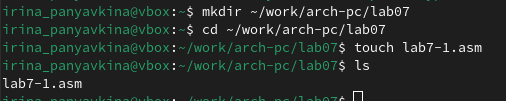{#fig:001 width=70%}

Копирую в текущий каталог файл in_out.asm с помощью утилиты cp, т.к. он будет использоваться в других программах (рис. [-@fig:002]).

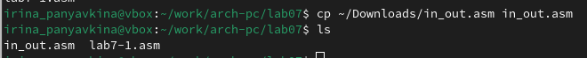{#fig:002 width=70%}

Копирую код из листинга в файл будущей программы. (рис. [-@fig:003]).

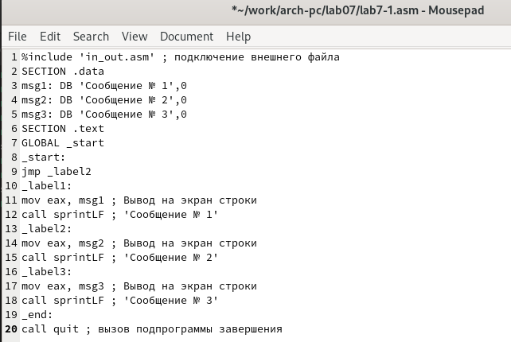{#fig:003 width=70%}

При запуске программы я убедилась в том, что неусловный переход действительно изменяет порядок выполнения инструкций (рис. [-@fig:004]).

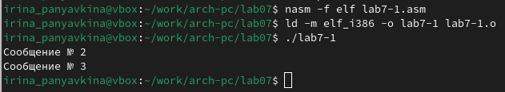{#fig:004 width=70%}

Изменяю программу таким образом, чтобы поменялся порядок выполнения функций (рис. [-@fig:005]).

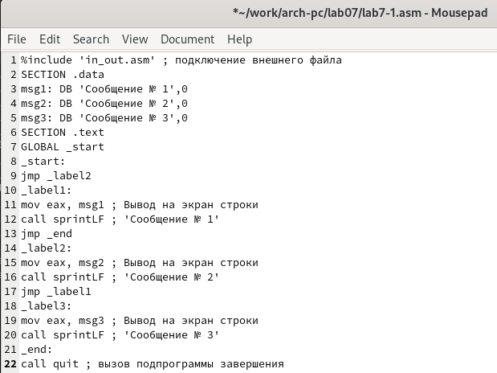{#fig:005 width=70%}

Запускаю программу и проверяю, что применённые изменения верны (рис. [-@fig:006]).

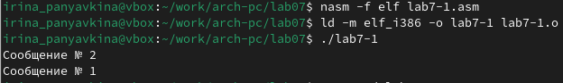{#fig:006 width=70%}

Теперь меняю текст программы так, чтобы все три сообщения вывелись в обратном порядке (рис. [-@fig:007]).

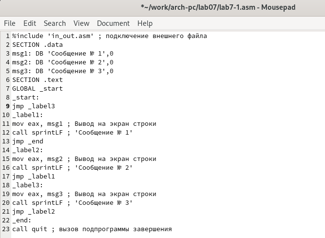{#fig:007 width=70%}

Работа выполнена верно, программа в нужном мне порядке выводит сообщения (рис. [-@fig:008]).

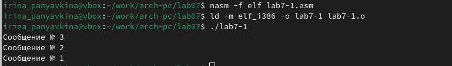{#fig:008 width=70%}

Создаю новый рабочий файл lab7-2.asm (рис. [-@fig:009]).

{#fig:009 width=70%}

Вставляю в него код из следующего листинга (рис. [-@fig:010])

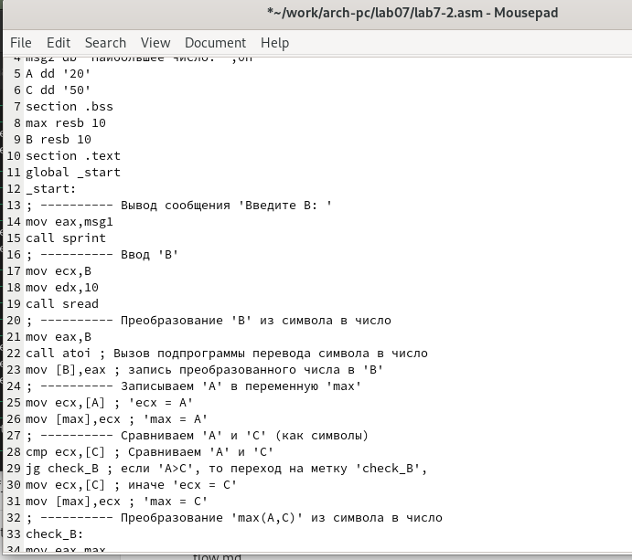{#fig:010 width=70%}

Программа выводит значение переменной с максимальным значением, проверяю работу программы (рис. [-@fig:011]).

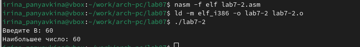{#fig:011 width=70%}

    Изучение структуры файла листинга

Получаю файл листинга, указав ключ -l и задав имя файла листинга в командной строке с помощью команды nasm (рис. [-@fig:012]).

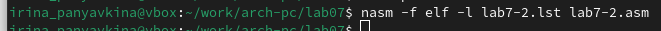{#fig:012 width=70%}

Открываю его с помощью текстового редактора mcedit (рис. [-@fig:013]).


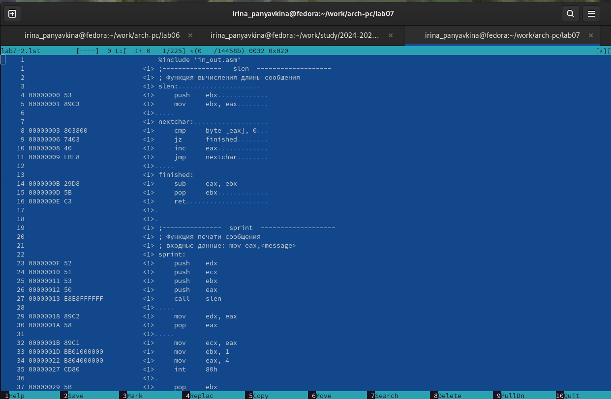{#fig:013 width=70%}

Первое значение в файле листинга - номер строки, и он может совсем не совпадать с номером строки изначального файла. Второе вхождение - адрес, смещение машинного кода относительно начала текущего сегмента, затем конечно же идет сам машинный код, а заключает строку исходный текст программы с комментариями.

Открываю файл в текстовом редакторе mousepad, так как в нем работать с файлом все-таки удобнее. Удаляю один операнд из случайной инструкции, чтобы проверить поведение файла листинга в дальнейшем (рис. [-@fig:014]).

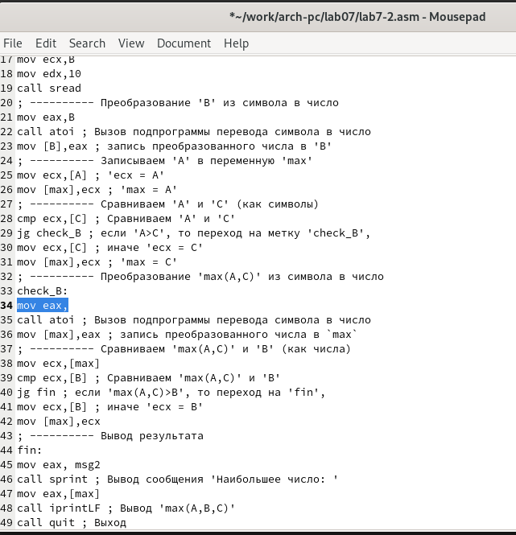{#fig:014 width=70%}

В новом файле листинга показывает ошибку, которая возникла при попытке трансляции файла. Никакие выходные файлы при этом помимо файла листинга не создаются. (рис. [-@fig:015]).


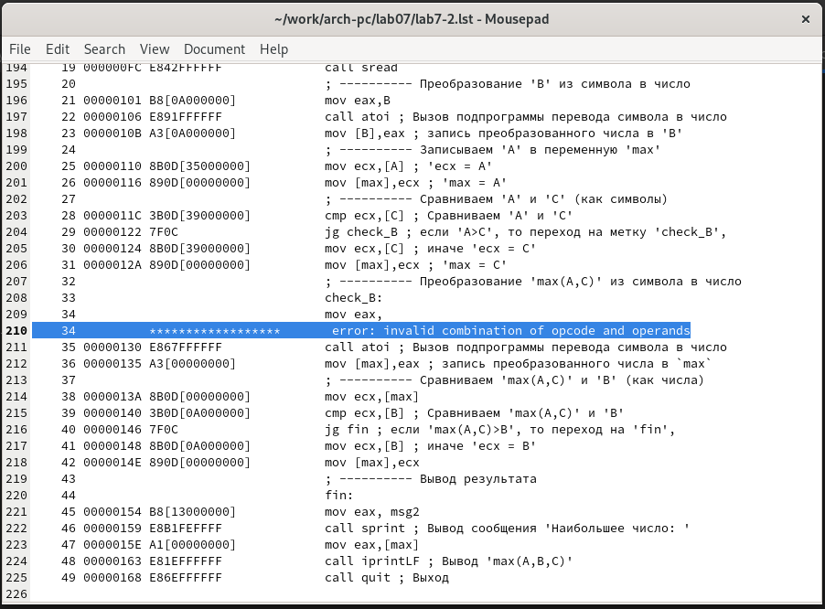{#fig:015 width=70%}

    Выполнение заданий для самостоятельной работы
При выполнении предыдущей лабораторной работы, с помощью программы я выяснила, что мой вариант — 15. Мне нужно использовать следующие переменные: a = 32, b = 6, c = 54. Возвращаю операнд к функции в программе и изменяю ее так, чтобы она выводила переменную с наименьшим значением (рис. [-@fig:016]).

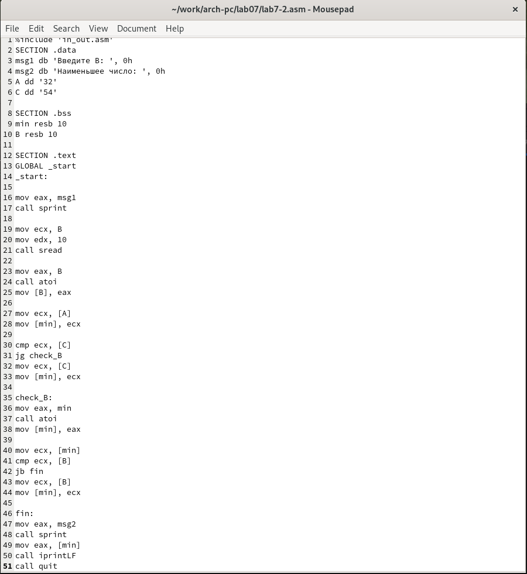{#fig:016 width=70%}

Код первой программы:
```asm
%include 'in_out.asm'
SECTION .data
msg1 db 'Введите В: ', 0h
msg2 db 'Наименьшее число: ', 0h
A dd '32'
C dd '54'
SECTION .bss
min resb 10
B resb 10
SECTION .text
GLOBAL _start
_start:

mov eax, msg1
call sprint

mov ecx, B
mov edx, 10
call sread

mov eax, B
call atoi
mov [B], eax

mov ecx, [A]
mov [min], ecx

cmp ecx, [C]
jg check_B
mov ecx, [C]
mov [min], ecx

check_B:
mov eax, min
call atoi
mov [min], eax

mov ecx, [min]
cmp ecx, [B]
jb fin
mov ecx, [B]
mov [min], ecx

fin:
mov eax, msg2
call sprint
mov eax, [min]
call iprintLF
call quit
```
Проверяю корректность написания первой программы (рис. [-@fig:017]).

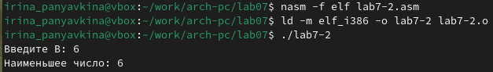{#fig:0017 width=70%}

Создаю программу, которая будет вычислять значение заданной функции, согласно моему варианту, для введённых с клавиатуры переменных а и x (рис. [-@fig:018]).


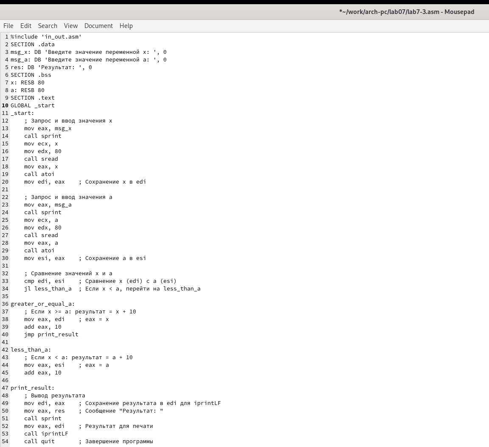{#fig:018 width=70%}

Код второй программы:
```asm
%include 'in_out.asm'
SECTION .data
msg_x: DB 'Введите значение переменной x: ', 0
msg_a: DB 'Введите значение переменной a: ', 0
res: DB 'Результат: ', 0
SECTION .bss
x: RESB 80
a: RESB 80
SECTION .text
GLOBAL _start
_start:
    ; Запрос и ввод значения x
    mov eax, msg_x
    call sprint
    mov ecx, x
    mov edx, 80
    call sread
    mov eax, x
    call atoi
    mov edi, eax    ; Сохранение x в edi

    ; Запрос и ввод значения a
    mov eax, msg_a
    call sprint
    mov ecx, a
    mov edx, 80
    call sread
    mov eax, a
    call atoi
    mov esi, eax    ; Сохранение a в esi

    ; Сравнение значений x и a
    cmp edi, esi    ; Сравнение x (edi) с a (esi)
    jl less_than_a  ; Если x < a, перейти на less_than_a

greater_or_equal_a:
    ; Если x >= a: результат = x + 10
    mov eax, edi    ; eax = x
    add eax, 10
    jmp print_result

less_than_a:
    ; Если x < a: результат = a + 10
    mov eax, esi    ; eax = a
    add eax, 10

print_result:
    ; Вывод результата
    mov edi, eax    ; Сохранение результата в edi для iprintLF
    mov eax, res    ; Сообщение "Результат: "
    call sprint
    mov eax, edi    ; Результат для печати
    call iprintLF
    call quit       ; Завершение программы
```
Транслирую и компоную файл, запускаю и проверяю работу программы для различных значений х и а, мне предложено использовать значения (2;3) и (4;2) (рис. [-@fig:019]).

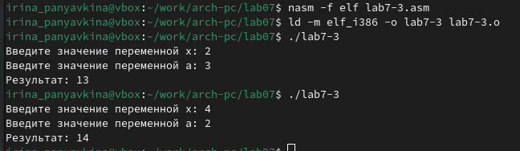{#fig:019 width=70%}

# Выводы

Во время выполнения лабораторной работы я изучила команды условных и безусловных переходов, а также приобрела навыки написания программ с использованием переходов, познакомилась с назначением и структурой файлов листинга.

# Список литературы{.unnumbered}
1. GDB: The GNU Project Debugger. — URL: https://www.gnu.org/software/gdb/.
2. GNU Bash Manual. — 2016. — URL: https://www.gnu.org/software/bash/manual/.
3. Midnight Commander Development Center. — 2021. — URL: https://midnight-commander. Org/.
4. NASM Assembly Language Tutorials. — 2021. — URL: https://asmtutor.com/.
5. Newham C. Learning the bash Shell: Unix Shell Programming. — O’Reilly Media, 2005. — 354 с. — (In a Nutshell). — ISBN 0596009658. — URL: http://www.amazon.com/Learningbash-Shell-Programming-Nutshell/dp/0596009658.
6. Robbins A. Bash Pocket Reference. — O’Reilly Media, 2016. — 156 с. — ISBN 978-1491941591.
7. The NASM documentation. — 2021. — URL: https://www.nasm.us/docs.php.
8. Zarrelli G. Mastering Bash. — Packt Publishing, 2017. — 502 с. — ISBN 9781784396879.
9. Колдаев В. Д., Лупин С. А. Архитектура ЭВМ. — М. : Форум, 2018.
10. Куляс О. Л., Никитин К. А. Курс программирования на ASSEMBLER. — М. : Солон-Пресс, 2017.
11. Новожилов О. П. Архитектура ЭВМ и систем. — М. : Юрайт, 2016.
12. Расширенный ассемблер: NASM. — 2021. — URL: https://www.opennet.ru/docs/RUS/nasm/.
13. Робачевский А., Немнюгин С., Стесик О. Операционная система UNIX. — 2-е изд. — БХВПетербург, 2010. — 656 с. — ISBN 978-5-94157-538-1.
14. Столяров А. Программирование на языке ассемблера NASM для ОС Unix. — 2-е изд. — М. : МАКС Пресс, 2011. — URL: http://www.stolyarov.info/books/asm_unix.
