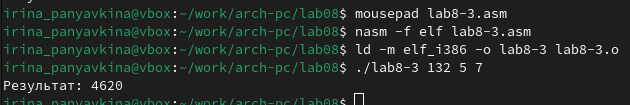

---
## Front matter
title: "Отчёт по лабораторной работе №8"
subtitle: "Архитектура компьютера"
author: "Ирина Васильевна Панявкина"

## Generic otions
lang: ru-RU
toc-title: "Содержание"

## Bibliography
bibliography: bib/cite.bib
csl: pandoc/csl/gost-r-7-0-5-2008-numeric.csl

## Pdf output format
toc: true # Table of contents
toc-depth: 2
lof: true # List of figures
lot: true # List of tables
fontsize: 12pt
linestretch: 1.5
papersize: a4
documentclass: scrreprt
## I18n polyglossia
polyglossia-lang:
  name: russian
  options:
	- spelling=modern
	- babelshorthands=true
polyglossia-otherlangs:
  name: english
## I18n babel
babel-lang: russian
babel-otherlangs: english
## Fonts
mainfont: IBM Plex Serif
romanfont: IBM Plex Serif
sansfont: IBM Plex Sans
monofont: IBM Plex Mono
mathfont: STIX Two Math
mainfontoptions: Ligatures=Common,Ligatures=TeX,Scale=0.94
romanfontoptions: Ligatures=Common,Ligatures=TeX,Scale=0.94
sansfontoptions: Ligatures=Common,Ligatures=TeX,Scale=MatchLowercase,Scale=0.94
monofontoptions: Scale=MatchLowercase,Scale=0.94,FakeStretch=0.9
mathfontoptions:
## Biblatex
biblatex: true
biblio-style: "gost-numeric"
biblatexoptions:
  - parentracker=true
  - backend=biber
  - hyperref=auto
  - language=auto
  - autolang=other*
  - citestyle=gost-numeric
## Pandoc-crossref LaTeX customization
figureTitle: "Рис."
tableTitle: "Таблица"
listingTitle: "Листинг"
lofTitle: "Список иллюстраций"
lotTitle: "Список таблиц"
lolTitle: "Листинги"
## Misc options
indent: true
header-includes:
  - \usepackage{indentfirst}
  - \usepackage{float} # keep figures where there are in the text
  - \floatplacement{figure}{H} # keep figures where there are in the text
---

# Цель работы

Приобретение навыков написания программ с использованием циклов и обработкой аргументов командной строки.

# Задание

    1.       Реализация циклом в NASM
	2.       Обработка аргументов командной строки
	3.       Самостоятельное написание программы по материалам лабораторной работы

# Теоретическое введение

    Стек — это структура данных, организованная по принципу LIFO («Last In — First Out» или «последним пришёл — первым ушёл»). Стек является частью архитектуры процессора и реализован на аппаратном уровне. Для работы со стеком в процессоре есть специальные регистры (ss, bp, sp) и команды.
	Основной функцией стека является функция сохранения адресов возврата и передачи аргументов при вызове процедур. Кроме того, в нём выделяется память для локальных переменных и могут временно храниться значения регистров. 
	Стек имеет вершину, адрес последнего добавленного элемента, который хранится в регистре esp (указатель стека). Противоположный конец стека называется дном. Значение, помещённое в стек последним, извлекается первым. При помещении значения в стек указатель стека уменьшается, а при извлечении — увеличивается. Для стека существует две основные операции:
    • добавление элемента в вершину стека (push); 
    • извлечение элемента из вершины стека (pop).

# Выполнение лабораторной работы

    Реализация циклов в NASM

Создаю каталог для программ лабораторной работы №8, а также файл lab8-1.asm и копирую в текущий каталог файл in_out.asm с помощью утилиты cp, т.к. он будет использоваться в других программах  (рис. [-@fig:001]).

{#fig:001 width=70%}

Открываю созданный файл и вставляю в него скопированную программу из листинга (рис. [-@fig:002]).

{#fig:002 width=70%}

Запускаю программу, убеждаюсь в том, что она показывает работу циклов в NASM (рис. [-@fig:003]).

{#fig:003 width=70%}

Изменяю программу таким образом: в теле цикла я изменяю значение регистра ecx (рис. [-@fig:004]).

{#fig:004 width=70%}

Теперь из-за того, что регистр ecx на каждой итерации уменьшается на 2 значения, количество итераций так же уменьшается в два раза (рис. [-@fig:005]).

{#fig:005 width=70%}

Редактирую программу, добавляя в неё команды push и pop (рис. [-@fig:006]).

{#fig:006 width=70%}

Вижу, что теперь количество итераций совпадает введённому N, однако произошло смещение выводимых чисел на -1 (рис. [-@fig:007]).

{#fig:007 width=70%}


    Обработка аргументов командной строки
    
Создаю новый рабочий файл lab8-2.asm и вставляю в него скопированную программу из следующего листинга (рис. [-@fig:008])

{#fig:008 width=70%}

Компилирую программу и запускаю, указав аргументы. Программа обработала то же количество аргументов, что и вводилось (рис. [-@fig:009]).

{#fig:009 width=70%}

Создаю новый рабочий файл lab8-3.asm и вставляю в него скопированную программу из третьего листинга (рис. [-@fig:010]).

{#fig:010 width=70%}

Компилирую программу и запускаю, указав в качестве аргументов некоторые числа, программа должна их складывать (рис. [-@fig:011]).

{#fig:011 width=70%}

Программа работает корректно, выдаёт верный результат.

Затем изменяю программу так, чтобы указанные аргументы умножались, а не складывались  (рис. [-@fig:012]).

{#fig:012 width=70%}

Теперь программа умножает введённые числа, результат верный (рис. [-@fig:013]).

{#fig:013 width=70%}


    Выполнение заданий для самостоятельной работы

При выполнении 6 лабораторной работы, с помощью программы я выяснила, что мой вариант — 15. Мне нужно написать программу, использовав следующую функцию: f(x)=6x+13  (рис. [-@fig:014]).

{#fig:014 width=70%}

Код первой программы:
```asm
%include 'in_out.asm'

SECTION .data
msg_func db "Функция: f(x) = 6x + 13", 0
msg_result db "Результат: ", 0

SECTION .text
GLOBAL _start

_start:
mov eax, msg_func
call sprintLF

pop ecx
pop edx
sub ecx, 1
mov esi, 0

next:
cmp ecx, 0
jz _end
pop eax
call atoi

mov ebx, 6
mul ebx
add eax, 13

add esi, eax

loop next

_end:
mov eax, msg_result
call sprint
mov eax, esi
call iprintLF
call quit
```
Проверяю корректность написания программы и её работу, указав в качестве аргумента несколько чисел (рис. [-@fig:015]).

{#fig:015 width=70%}

Программа работает успешно, результат получается правильным — соответствует условию задания.

# Выводы

Выполнив данную лабораторную работу, я приобрела навыки написания программ с использованием циклов и обработкой аргументов командной строки.

# Список литературы{.unnumbered}

1. GDB: The GNU Project Debugger. — URL: https://www.gnu.org/software/gdb/.
2. GNU Bash Manual. — 2016. — URL: https://www.gnu.org/software/bash/manual/.
3. Midnight Commander Development Center. — 2021. — URL: https://midnight-commander. Org/.
4. NASM Assembly Language Tutorials. — 2021. — URL: https://asmtutor.com/.
5. Newham C. Learning the bash Shell: Unix Shell Programming. — O’Reilly Media, 2005. — 354 с. — (In a Nutshell). — ISBN 0596009658. — URL: http://www.amazon.com/Learningbash-Shell-Programming-Nutshell/dp/0596009658.
6. Robbins A. Bash Pocket Reference. — O’Reilly Media, 2016. — 156 с. — ISBN 978-1491941591.
7. The NASM documentation. — 2021. — URL: https://www.nasm.us/docs.php.
8. Zarrelli G. Mastering Bash. — Packt Publishing, 2017. — 502 с. — ISBN 9781784396879.
9. Колдаев В. Д., Лупин С. А. Архитектура ЭВМ. — М. : Форум, 2018.
10. Куляс О. Л., Никитин К. А. Курс программирования на ASSEMBLER. — М. : Солон-Пресс, 2017.
11. Новожилов О. П. Архитектура ЭВМ и систем. — М. : Юрайт, 2016.
12. Расширенный ассемблер: NASM. — 2021. — URL: https://www.opennet.ru/docs/RUS/nasm/.
13. Робачевский А., Немнюгин С., Стесик О. Операционная система UNIX. — 2-е изд. — БХВПетербург, 2010. — 656 с. — ISBN 978-5-94157-538-1.
14. Столяров А. Программирование на языке ассемблера NASM для ОС Unix. — 2-е изд. — М. : МАКС Пресс, 2011. — URL: http://www.stolyarov.info/books/asm_unix.
15. Таненбаум Э. Архитектура компьютера. — 6-е изд. — СПб. : Питер, 2013. — 874 с. — (Классика Computer Science).
16. Таненбаум Э., Бос Х. Современные операционные системы. — 4-е изд. — СПб. : Питер, 2015. — 1120 с. — (Классика Computer Science).
