---
## Front matter
title: "Отчёт по лабораторной работе №9"
subtitle: "Архитектура компьютера"
author: "Ирина Васильевна Панявкина"

## Generic otions
lang: ru-RU
toc-title: "Содержание"

## Bibliography
bibliography: bib/cite.bib
csl: pandoc/csl/gost-r-7-0-5-2008-numeric.csl

## Pdf output format
toc: true # Table of contents
toc-depth: 2
lof: true # List of figures
lot: true # List of tables
fontsize: 12pt
linestretch: 1.5
papersize: a4
documentclass: scrreprt
## I18n polyglossia
polyglossia-lang:
  name: russian
  options:
	- spelling=modern
	- babelshorthands=true
polyglossia-otherlangs:
  name: english
## I18n babel
babel-lang: russian
babel-otherlangs: english
## Fonts
mainfont: IBM Plex Serif
romanfont: IBM Plex Serif
sansfont: IBM Plex Sans
monofont: IBM Plex Mono
mathfont: STIX Two Math
mainfontoptions: Ligatures=Common,Ligatures=TeX,Scale=0.94
romanfontoptions: Ligatures=Common,Ligatures=TeX,Scale=0.94
sansfontoptions: Ligatures=Common,Ligatures=TeX,Scale=MatchLowercase,Scale=0.94
monofontoptions: Scale=MatchLowercase,Scale=0.94,FakeStretch=0.9
mathfontoptions:
## Biblatex
biblatex: true
biblio-style: "gost-numeric"
biblatexoptions:
  - parentracker=true
  - backend=biber
  - hyperref=auto
  - language=auto
  - autolang=other*
  - citestyle=gost-numeric
## Pandoc-crossref LaTeX customization
figureTitle: "Рис."
tableTitle: "Таблица"
listingTitle: "Листинг"
lofTitle: "Список иллюстраций"
lotTitle: "Список таблиц"
lolTitle: "Листинги"
## Misc options
indent: true
header-includes:
  - \usepackage{indentfirst}
  - \usepackage{float} # keep figures where there are in the text
  - \floatplacement{figure}{H} # keep figures where there are in the text
---

# Цель работы

Приобретение навыков написания программ с использованием подпрограмм. Знакомство с методами отладки при помощи GDB и его основными возможностями.

# Задание

    1. Реализация подпрограмм в NASM
    2. Отладка программ с помощью GDB
    3. Самостоятельное выполнение заданий по материалам лабораторной работы

# Теоретическое введение
Отладка — это процесс поиска и исправления ошибок в программе. В общем случае его можно разделить на четыре этапа:
    • обнаружение ошибки;
    • поиск её местонахождения; 
    • определение причины ошибки; 
    • исправление ошибки.
	
Можно выделить следующие типы ошибок:
    • синтаксические ошибки — обнаруживаются во время трансляции исходного кода и вызваны нарушением ожидаемой формы или структуры языка;
    • семантические ошибки — являются логическими и приводят к тому, что программа запускается, отрабатывает, но не даёт желаемого результата;
    • ошибки в процессе выполнения — не обнаруживаются при трансляции и вызывают пре- рывание выполнения программы (например, это ошибки, связанные с переполнением или делением на ноль).
	Второй этап — поиск местонахождения ошибки. Некоторые ошибки обнаружить довольно трудно. Лучший способ найти место в программе, где находится ошибка, это разбить программу на части и произвести их отладку отдельно друг от друга.
	Третий этап — выяснение причины ошибки. После определения местонахождения ошибки обычно проще определить причину неправильной работы программы. Последний этап — исправление ошибки. После этого при повторном запуске программы, может обнаружиться следующая ошибка, и процесс отладки начнётся заново.

# Выполнение лабораторной работы

    Реализация подпрограмм в NASM
    
Создаю каталог для программ лабораторной работы №9, а также файл lab9-1.asm и копирую в текущий каталог файл in_out.asm с помощью утилиты cp, т.к. он будет использоваться во время выполнения самостоятельной работы (рис. [-@fig:001]).

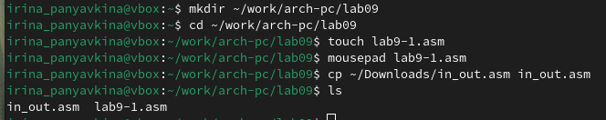{#fig:001 width=70%}

Открываю созданный файл и вставляю в него скопированную программу из листинга, компилирую и запускаю его, программа выполняет вычисление функции (рис. [-@fig:002]).

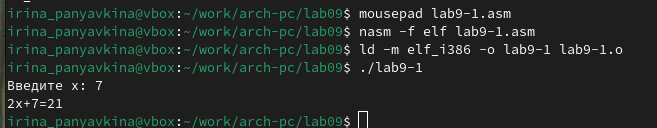{#fig:002 width=70%}

Изменяю программу, добавив в неё подпрограмму, таким образом, чтобы она вычисляла значение функции для выражения f(g(x)) (рис. [-@fig:003]).

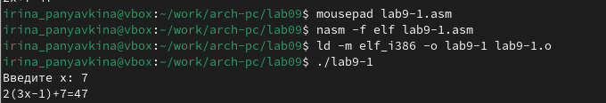{#fig:003 width=70%}

Код программы:
```asm
%include 'in_out.asm'

SECTION .data
msg: DB 'Введите x: ', 0
result: DB '2(3x-1)+7=', 0

SECTION .bss
x: RESB 80
res: RESB 80

SECTION .text
GLOBAL _start
_start:
mov eax, msg
call sprint

mov ecx, x
mov edx, 80
call sread

mov eax, x
call atoi

call _calcul

mov eax, result
call sprint
mov eax, [res]
call iprintLF

call quit

_calcul:
push eax
call _subcalcul

mov ebx, 2
mul ebx
add eax, 7

mov [res], eax
pop eax
ret

_subcalcul:
mov ebx, 3
mul ebx
sub eax, 1
ret
```

    Отладка программ с помощью GDB
    
В созданный файл копирую программу второго листинга, транслирую с созданием файла листинга и отладки, компоную и запускаю в отладчике (рис. [-@fig:004]).

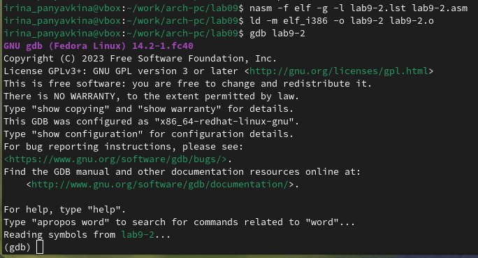{#fig:004 width=70%}

Запустив программу командой run, я убедилась в том, что она работает корректно (рис. [-@fig:005]).

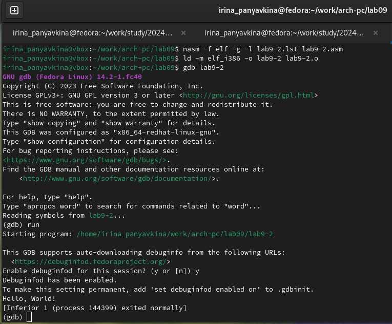{#fig:005 width=70%}

Для более подробного анализа программы добавляю брейкпоинт на метку _start и снова запускаю отладку (рис. [-@fig:006]).

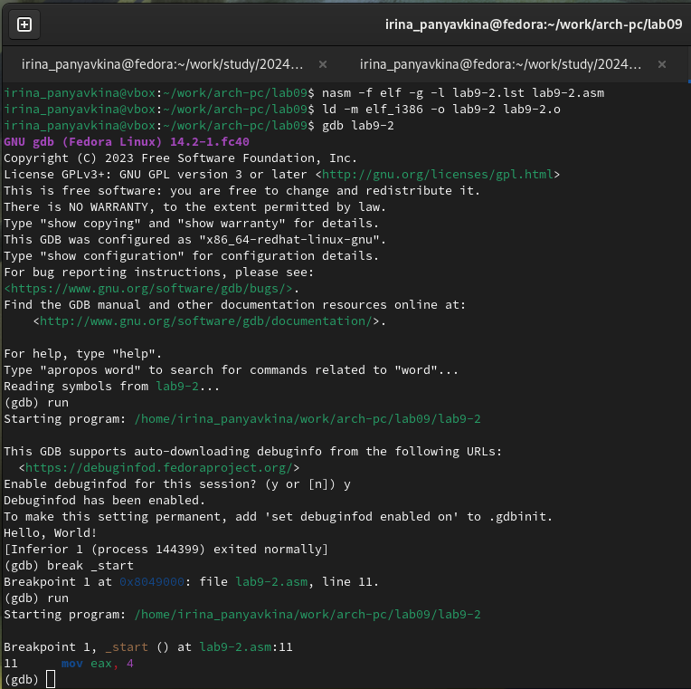{#fig:006 width=70%}

Различия между синтаксисом ATT и Intel заключаются в порядке операндов (ATT - Операнд источника указан первым. Intel - Операнд назначения указан первым), их размере (ATT - pазмер операндов указывается явно с помощью суффиксов, непосредственные операнды предваряются символом $; Intel - Размер операндов неявно определяется контекстом, как ax, eax, непосредственные операнды пишутся напрямую), именах регистров(ATT -имена регистров предваряются символом %, Intel - имена регистров пишутся без префиксов).

Затем смотрю дисассимилированный код программы, переключаюсь на отображение команд с синтаксисом Intel (рис. [-@fig:007]).

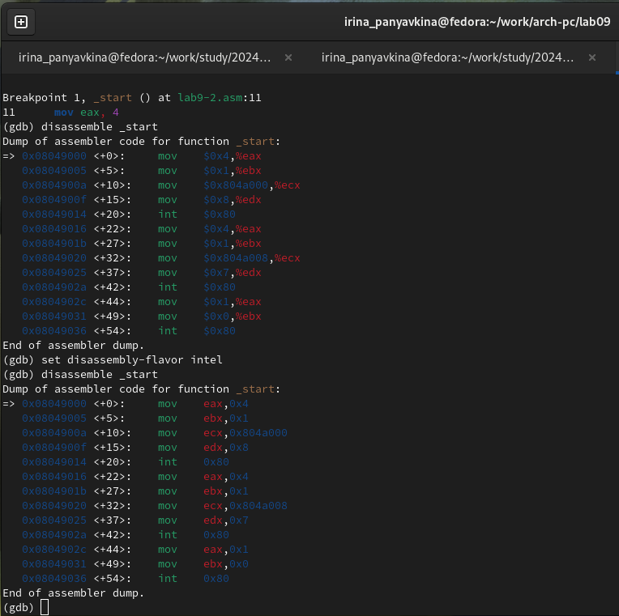{#fig:007 width=70%}

Включаю режим псевдографики для более удобного анализа программы. К сожалению, во время выполнения работы, я столкнулась с проблемой («Register Values Unavailable»): интерфейс TUI не смог корректно распознать и отобразить все регистры в помощью предложенной команды «layout regs», все попытки исправить проблему оказались тщетными, причина мне так и неизвестна (делала строго опираясь на лекцию), поэтому мне пришлось воспользоваться другой командой и вывести список регистров иным способом с помощью «tui reg general». (рис. [-@fig:008])

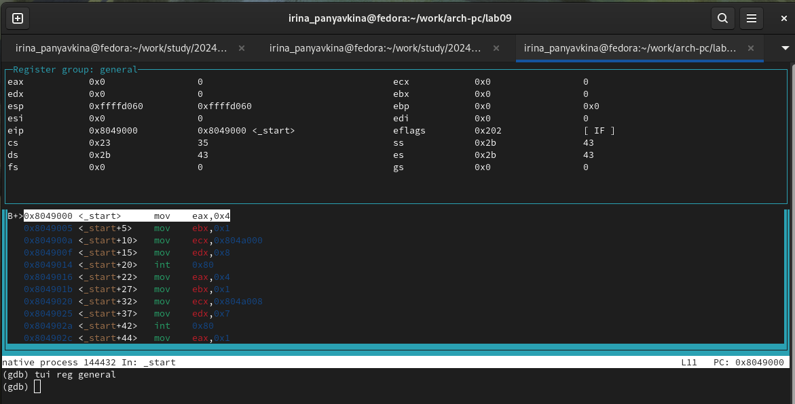{#fig:008 width=70%}

    Добавление точек останова
    
Проверяю в режиме псевдографики, что брейкпоинт сохранился (рис. [-@fig:009]).

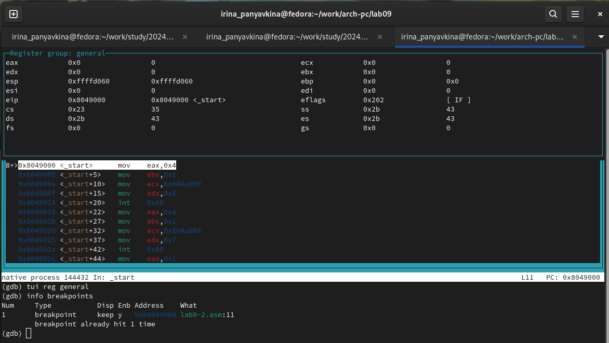{#fig:009 width=70%}

Устанавливаю ещё одну точку останова по адресу инструкции  (рис. [-@fig:010]).

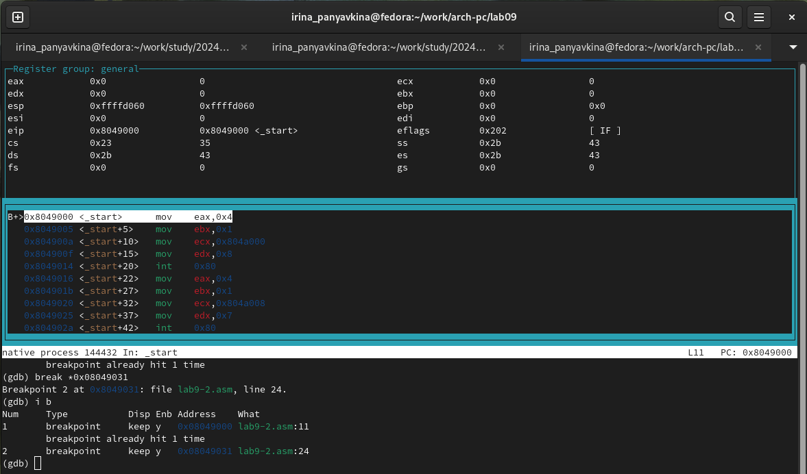{#fig:010 width=70%}

    Работа с данными программы в GDB
    
Просматриваю содержимое регистров с помощью команды «info registers» (рис. [-@fig:011]).

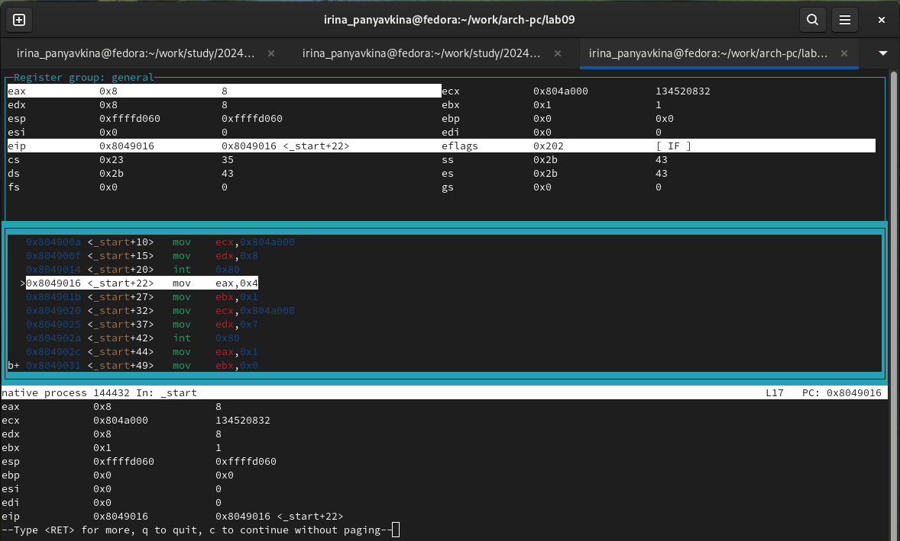{#fig:011 width=70%}

Смотрю содержимое переменных по имени и адресу  (рис. [-@fig:012]).

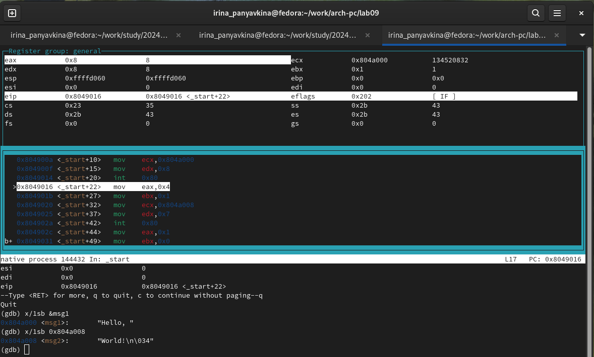{#fig:012 width=70%}

Меняю содержимое переменных по имени и адресу (рис. [-@fig:013]).

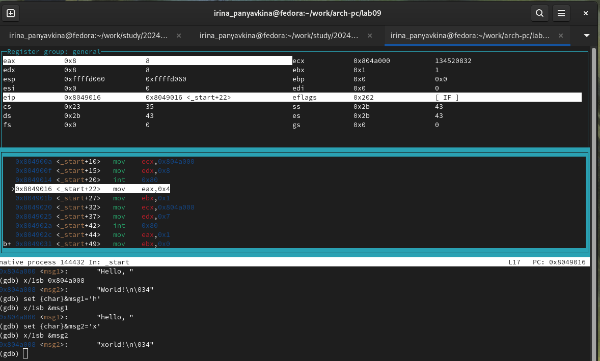{#fig:013 width=70%}

Вывожу в различных форматах значение регистра edx (рис. [-@fig:014]).

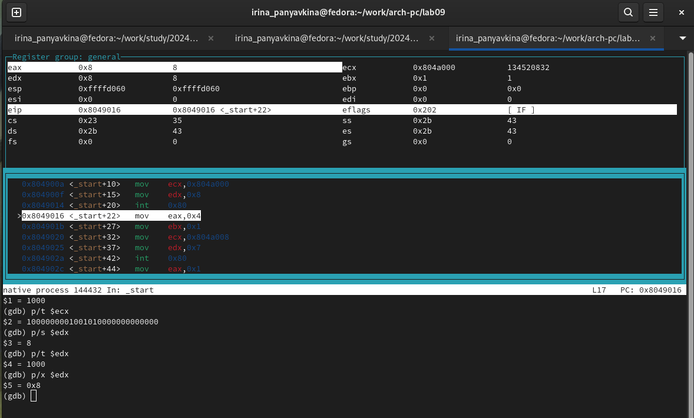{#fig:014 width=70%}

С помощью команды set меняю содержимое регистра ebx (рис. [-@fig:015]).

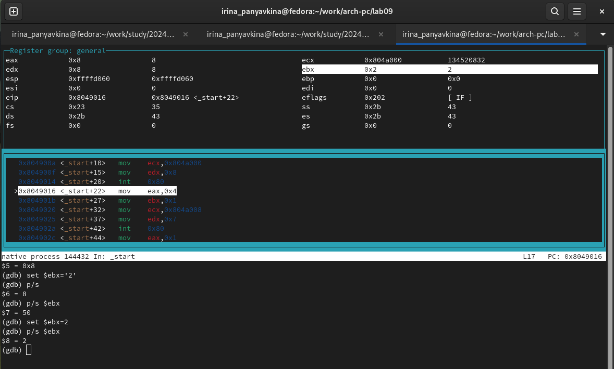{#fig:015 width=70%}

    Обработка аргументов командной строки в GDB
    
Копирую программу из предыдущей лабораторной работы в текущий каталог и создаю исполняемый файл с файлом листинга и отладки (рис. [-@fig:016]).

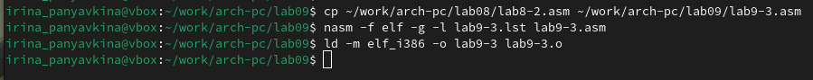{#fig:016 width=70%}

Запускаю программу с режиме отладки с указанием аргументов, указываю брейкпоинт и запускаю отладку. Проверяю работу стека, изменяя аргумент команды просмотра регистра esp на +4, число обусловлено разрядностью системы, а указатель void занимает как раз 4 байта, ошибка при аргументе +24 означает, что аргументы на вход программы закончились.  (рис. [-@fig:017]).

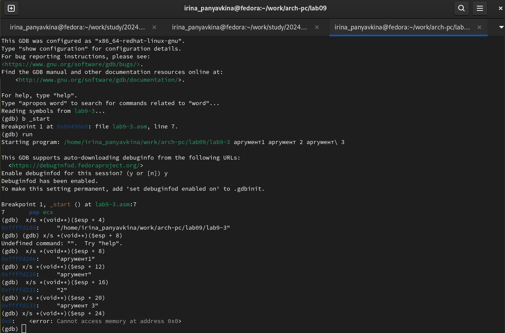{#fig:017 width=70%}

    Выполнение заданий для самостоятельной работы
    
1. Меняю программу самостоятельной части предыдущей лабораторной работы с использованием подпрограммы (рис. [-@fig:018]).

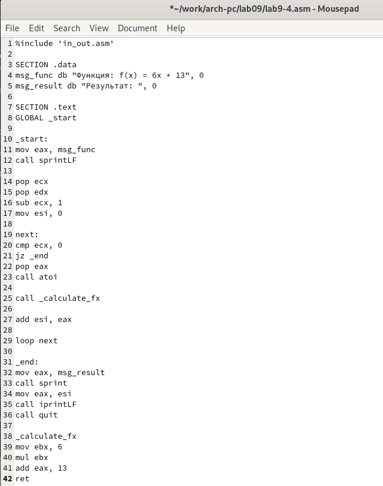{#fig:018 width=70%}

Код программы:
```asm
%include 'in_out.asm'

SECTION .data
msg_func db "Функция: f(x) = 6x + 13", 0
msg_result db "Результат: ", 0

SECTION .text
GLOBAL _start

_start:
mov eax, msg_func
call sprintLF

pop ecx
pop edx
sub ecx, 1
mov esi, 0

next:
cmp ecx, 0
jz _end
pop eax
call atoi

call _calculate_fx

add esi, eax

loop next

_end:
mov eax, msg_result
call sprint
mov eax, esi
call iprintLF
call quit

_calculate_fx
mov ebx, 6
mul ebx
add eax, 13
ret
```
	
2. Запускаю программу в режиме отладчика и пошагово через «stepi» просматриваю изменение значений регистров через «info registers». При выполнении инструкции «mul ecx» можно заметить, что результат умножения записывается в регистр eax, но также меняет и edx. Значение регистра ebx не обновляется напрямую, поэтому в результате программа неверно высчитывает функцию (рис. [-@fig:019]).

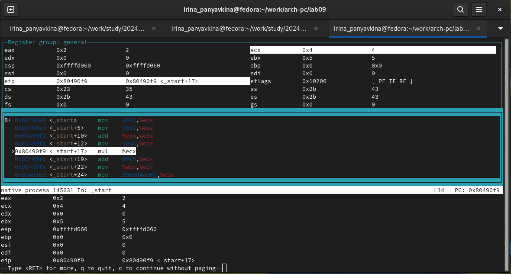{#fig:019 width=70%}

Исправляю найденную ошибку, теперь программа правильно считает значение функции (рис. [-@fig:020]).

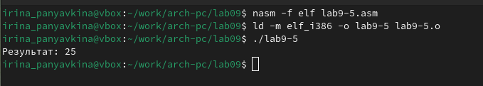{#fig:020 width=70%}

Код изменённой программы:
```asm 
%include 'in_out.asm'

SECTION .data
div: DB 'Результат: ', 0

SECTION .text
GLOBAL _start
_start:

mov ebx, 3
mov eax, 2
add ebx, eax
mov eax, ebx
mov ecx, 4
mul ecx
add eax, 5
mov edi, eax

mov eax, div
call sprint
mov eax, edi
call iprintLF

call quit
```
# Выводы

В ходе выполнения лабораторной работы, я приобрела навыки написания программ с использованием подпрограмм и познанакомилась с методами отладки при помощи GDB и его основными возможностями. 

# Список литературы{.unnumbered}

1. GDB: The GNU Project Debugger. — URL: https://www.gnu.org/software/gdb/.
2. GNU Bash Manual. — 2016. — URL: https://www.gnu.org/software/bash/manual/.
3. Midnight Commander Development Center. — 2021. — URL: https://midnight-commander. Org/.
4. NASM Assembly Language Tutorials. — 2021. — URL: https://asmtutor.com/.
5. Newham C. Learning the bash Shell: Unix Shell Programming. — O’Reilly Media, 2005. — 354 с. — (In a Nutshell). — ISBN 0596009658. — URL: http://www.amazon.com/Learningbash-Shell-Programming-Nutshell/dp/0596009658.
6. Robbins A. Bash Pocket Reference. — O’Reilly Media, 2016. — 156 с. — ISBN 978-1491941591.
7. The NASM documentation. — 2021. — URL: https://www.nasm.us/docs.php.
8. Zarrelli G. Mastering Bash. — Packt Publishing, 2017. — 502 с. — ISBN 9781784396879.
9. Колдаев В. Д., Лупин С. А. Архитектура ЭВМ. — М. : Форум, 2018.
10. Куляс О. Л., Никитин К. А. Курс программирования на ASSEMBLER. — М. : Солон-Пресс, 2017.
11. Новожилов О. П. Архитектура ЭВМ и систем. — М. : Юрайт, 2016.
12. Расширенный ассемблер: NASM. — 2021. — URL: https://www.opennet.ru/docs/RUS/nasm/.
13. Робачевский А., Немнюгин С., Стесик О. Операционная система UNIX. — 2-е изд. — БХВПетербург, 2010. — 656 с. — ISBN 978-5-94157-538-1.
14. Столяров А. Программирование на языке ассемблера NASM для ОС Unix. — 2-е изд. — М. : МАКС Пресс, 2011. — URL: http://www.stolyarov.info/books/asm_unix.
15. Таненбаум Э. Архитектура компьютера. — 6-е изд. — СПб. : Питер, 2013. — 874 с. — (Классика Computer Science).
16. Таненбаум Э., Бос Х. Современные операционные системы. — 4-е изд. — СПб. : Питер, 2015. — 1120 с. — (Классика Computer Science).
