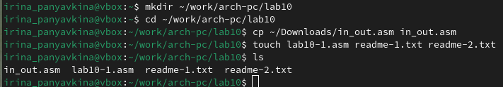
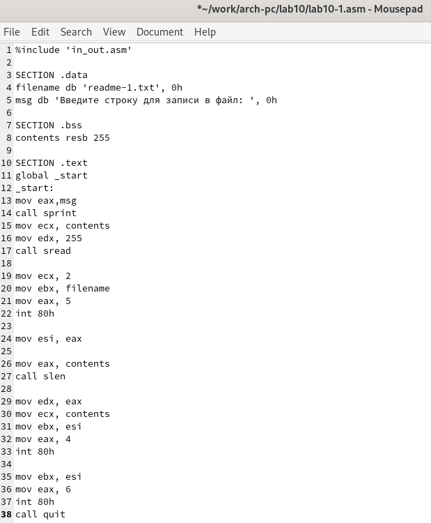
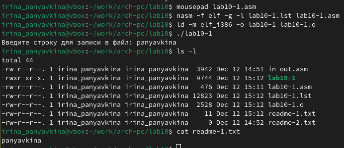
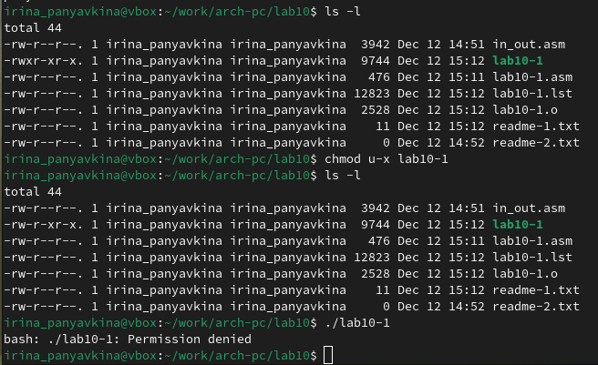
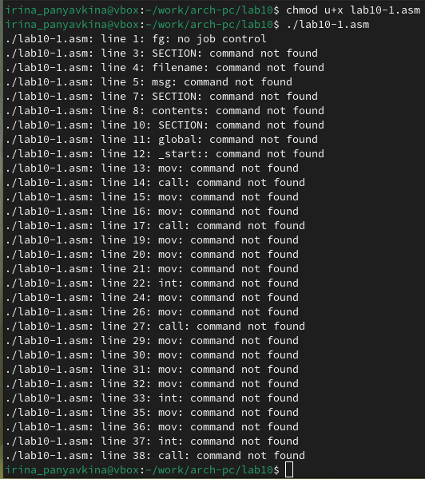
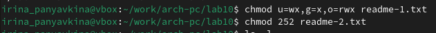
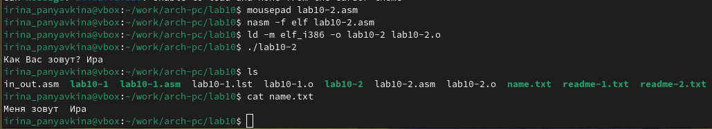

---
## Front matter
title: "Отчёт по лабораторной работе №10"
subtitle: "Архитектура компьютера"
author: "Ирина Васильевна Панявкина"

## Generic otions
lang: ru-RU
toc-title: "Содержание"

## Bibliography
bibliography: bib/cite.bib
csl: pandoc/csl/gost-r-7-0-5-2008-numeric.csl

## Pdf output format
toc: true # Table of contents
toc-depth: 2
lof: true # List of figures
lot: true # List of tables
fontsize: 12pt
linestretch: 1.5
papersize: a4
documentclass: scrreprt
## I18n polyglossia
polyglossia-lang:
  name: russian
  options:
	- spelling=modern
	- babelshorthands=true
polyglossia-otherlangs:
  name: english
## I18n babel
babel-lang: russian
babel-otherlangs: english
## Fonts
mainfont: IBM Plex Serif
romanfont: IBM Plex Serif
sansfont: IBM Plex Sans
monofont: IBM Plex Mono
mathfont: STIX Two Math
mainfontoptions: Ligatures=Common,Ligatures=TeX,Scale=0.94
romanfontoptions: Ligatures=Common,Ligatures=TeX,Scale=0.94
sansfontoptions: Ligatures=Common,Ligatures=TeX,Scale=MatchLowercase,Scale=0.94
monofontoptions: Scale=MatchLowercase,Scale=0.94,FakeStretch=0.9
mathfontoptions:
## Biblatex
biblatex: true
biblio-style: "gost-numeric"
biblatexoptions:
  - parentracker=true
  - backend=biber
  - hyperref=auto
  - language=auto
  - autolang=other*
  - citestyle=gost-numeric
## Pandoc-crossref LaTeX customization
figureTitle: "Рис."
tableTitle: "Таблица"
listingTitle: "Листинг"
lofTitle: "Список иллюстраций"
lotTitle: "Список таблиц"
lolTitle: "Листинги"
## Misc options
indent: true
header-includes:
  - \usepackage{indentfirst}
  - \usepackage{float} # keep figures where there are in the text
  - \floatplacement{figure}{H} # keep figures where there are in the text
---

# Цель работы

Приобретение навыков написания программ для работы с файлами.

# Задание

1. Создание файлов в программах
2. Изменение прав на файлы для разных групп пользователей
3. Выполнение самостоятельных заданий по материалам лабораторной работы

# Теоретическое введение

ОС GNU/Linux является многопользовательской операционной системой. И
для обеспече- ния защиты данных одного пользователя от действий других
пользователей существуют специальные механизмы разграничения доступа к
файлам. Кроме ограничения доступа, дан- ный механизм позволяет разрешить
другим пользователям доступ данным для совместной работы.

# Выполнение лабораторной работы

Создаю каталог для программ лабораторной работы №10, а также файл lab9-1.asm и копирую в текущий каталог файл in_out.asm с помощью утилиты cp, т.к. он будет использоваться во время выполнения лабораторной работы. Затем создаю необходимые для работы файлы (рис. [-@fig:001]).

{#fig:001 width=70%}

Редактирую созданный файл lab10-1.asm и вставляю в него программу из первого листинга (рис. [-@fig:002]).

{#fig:002 width=70%}

Запускаю программу: она просит на ввод строку, а затем создаёт текстовый
файл с введённой пользователем строкой (рис. [-@fig:003]).

{#fig:003 width=70%}

Меняю права владельца: запрещаю исполнять файл. После этого система начинает отказывать в исполнении файла, т.к. я - владелец - запретила самой себе же исполнять
программу (рис. [-@fig:004]).

{#fig:004 width=70%}

Добавляю к исходному файлу программы права владельцу на исполнение,
исполняемый текстовый файл интерпретирует каждую строку как команду, и из-за того, что ни одна из строк не является командой bash, программа абсолютно ничего
не выполняет (рис. [-@fig:005]).

{#fig:005 width=70%}

Согласно своему варианту, мне нужно установить соответствующие ему права
на текстовые файлы, созданные в начале лабораторной работы:
1. В символьном виде для 1-го readme файла: -wx --x rwx
2. В двоичной системе для 2-го readme файла: 010 101 010

Перевожу группу битов в восьмеричную систему, символьную запись подбираю
под синтаксис и получаю нужные мне аргументы для chmod (рис. [-@fig:006]).

{#fig:006 width=70%}

## Выполнение самостоятельной работы

Создаю код программы, затем транслириую её и компилирую. Программа должна выводить
приглашение, просить ввод с клавиатуры и создавать текстовый файл с указанной в программе строкой и вводом пользователя. Запускаю программу, проверяю
наличие и содержание созданного текстого файла, программа работает правильно (рис. [-@fig:007])

{#fig:007 width=70%}

Код программы:

```asm
%include 'in_out.asm'

SECTION .data
filename db 'name.txt', 0
prompt db 'Как Вас зовут?', 0
intro db 'Меня зовут ', 0

SECTION .bss
name resb 255

SECTION .text
global _start
_start:
mov eax, prompt
call sprint

mov ecx, name
mov edx, 255
call sread

mov eax, 8
mov ebx, filename
mov ecx, 0744o
int 80h

mov esi, eax

mov eax, intro
call slen
mov edx, eax
mov ecx, intro
mov ebx, esi
mov eax, 4
int 80h

mov eax, name
call slen
mov edx, eax
mov ecx, name
mov ebx, esi
mov eax, 4
int 80h

mov ebx, esi
mov eax, 6
int 80h

call quit
```

# Выводы

В ходе выполнения лабораторной работы, я приобрела навыки написания программ для работы с файлами.

# Список литературы

1. GDB: The GNU Project Debugger. — URL: https://www.gnu.org/software/gdb/.
2. GNU Bash Manual. — 2016. — URL: https://www.gnu.org/software/bash/manual/.
3. Midnight Commander Development Center. — 2021. — URL: https://midnight-commander. Org/.
4. NASM Assembly Language Tutorials. — 2021. — URL: https://asmtutor.com/.
5. Newham C. Learning the bash Shell: Unix Shell Programming. — O’Reilly Media, 2005. — 354 с. — (In a Nutshell). — ISBN 0596009658. — URL: http://www.amazon.com/Learningbash-Shell-Programming-Nutshell/dp/0596009658.
6. Robbins A. Bash Pocket Reference. — O’Reilly Media, 2016. — 156 с. — ISBN 978-1491941591.
7. The NASM documentation. — 2021. — URL: https://www.nasm.us/docs.php.
8. Zarrelli G. Mastering Bash. — Packt Publishing, 2017. — 502 с. — ISBN 9781784396879.
9. Колдаев В. Д., Лупин С. А. Архитектура ЭВМ. — М. : Форум, 2018.
10. Куляс О. Л., Никитин К. А. Курс программирования на ASSEMBLER. — М. : Солон-Пресс, 2017.
11. Новожилов О. П. Архитектура ЭВМ и систем. — М. : Юрайт, 2016.
12. Расширенный ассемблер: NASM. — 2021. — URL: https://www.opennet.ru/docs/RUS/nasm/.
13. Робачевский А., Немнюгин С., Стесик О. Операционная система UNIX. — 2-е изд. — БХВПетербург, 2010. — 656 с. — ISBN 978-5-94157-538-1.
14. Столяров А. Программирование на языке ассемблера NASM для ОС Unix. — 2-е изд. — М. : МАКС Пресс, 2011. — URL: http://www.stolyarov.info/books/asm_unix.
15. Таненбаум Э. Архитектура компьютера. — 6-е изд. — СПб. : Питер, 2013. — 874 с. — (Классика Computer Science).
16. Таненбаум Э., Бос Х. Современные операционные системы. — 4-е изд. — СПб. : Питер, 2015. — 1120 с. — (Классика Computer Science).

